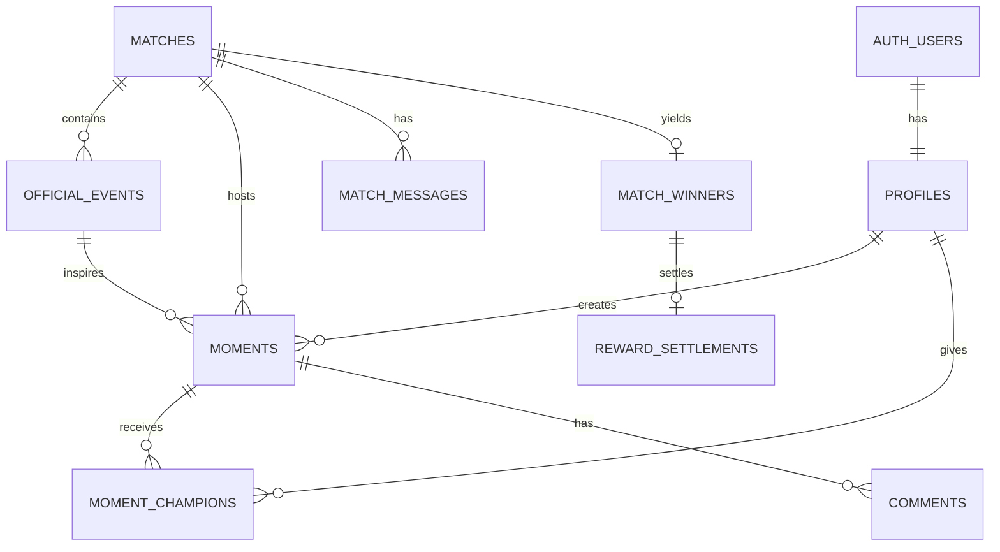

# Momento Database Schema

> The schema exists to support one winning loop: official TxLINE event -> fan Moment -> Champion action -> Moment of the Match.

## Conventions

- PostgreSQL via Supabase.
- Primary keys are UUID v7/`gen_random_uuid()` except TxLINE identifiers, stored as `bigint`.
- All timestamps are `timestamptz` in UTC.
- Soft moderation uses `status`; content is not hard-deleted during the hackathon.
- Provider payloads are retained as `jsonb` for debugging, while UI queries use normalized columns.

## Entity map

## Tables

### `profiles`

| Column | Type | Rules |
|---|---|---|
| `id` | uuid | PK, FK `auth.users(id)` cascade |
| `handle` | citext | unique, 3-24 chars |
| `display_name` | text | 1-50 chars |
| `avatar_path` | text | nullable |
| `wallet_address` | text | nullable, unique |
| `role` | text | `fan`, `moderator`, `admin` |
| `created_at`, `updated_at` | timestamptz | defaults now |

Indexes: unique lower-case handle; partial unique wallet where non-null.

### `matches`

| Column | Type | Rules |
|---|---|---|
| `id` | uuid | PK |
| `txline_fixture_id` | bigint | unique, required |
| `competition_id`, `fixture_group_id` | integer | nullable until known |
| `competition_name` | text | required |
| `home_team_id`, `away_team_id` | integer | required |
| `home_team_name`, `away_team_name` | text | required |
| `home_score`, `away_score` | smallint | default 0 |
| `starts_at` | timestamptz | required |
| `state` | text | provider-normalized state |
| `data_mode` | text | `live`, `cached`, `replay` |
| `last_provider_update_at` | timestamptz | nullable |
| `last_ingested_at` | timestamptz | nullable |
| `champions_locked_at`, `finalized_at` | timestamptz | nullable |
| `raw_fixture` | jsonb | required default `{}` |
| `created_at`, `updated_at` | timestamptz | defaults now |

Indexes: `(state, starts_at)`, `(starts_at desc)`, unique `txline_fixture_id`.

### `official_events`

| Column | Type | Rules |
|---|---|---|
| `id` | uuid | PK |
| `match_id` | uuid | FK matches cascade |
| `provider_event_key` | text | required |
| `event_type` | text | `goal`, `penalty`, `card`, `shot`, `save`, `var`, `phase`, `corner`, `substitution`, `other` |
| `participant_id`, `player_id` | integer | nullable |
| `match_minute`, `stoppage_minute` | smallint | nullable |
| `provider_ts` | bigint | required |
| `title`, `detail` | text | presentation-safe normalized copy |
| `confirmed` | boolean | default false |
| `amends_event_id` | uuid | nullable self FK |
| `capture_eligible` | boolean | default false |
| `capture_closes_at` | timestamptz | nullable |
| `raw_payload` | jsonb | optional sanitized provider record for replay/debugging |
| `created_at`, `updated_at` | timestamptz | defaults now |

Indexes: unique `(match_id, provider_event_key)`, `(match_id, provider_ts desc)`, partial `(match_id, capture_closes_at)` where eligible.

### `moments`

| Column | Type | Rules |
|---|---|---|
| `id` | uuid | PK |
| `match_id` | uuid | FK matches cascade |
| `official_event_id` | uuid | FK official events restrict |
| `creator_id` | uuid | FK profiles restrict |
| `title` | text | 3-60 chars |
| `caption` | text | max 220 chars, nullable |
| `video_path` | text | unique, private Storage path |
| `duration_ms` | integer | 1-15000 |
| `mime_type` | text | must be `video/mp4` |
| `byte_size` | bigint | max 25 MB |
| `status` | text | `published`, `hidden`, `removed` |
| `champion_count` | integer | cached, non-negative |
| `published_at`, `created_at`, `updated_at` | timestamptz | timestamps |

Indexes: `(match_id, status, champion_count desc, published_at)`, `(creator_id, created_at desc)`, `(official_event_id, published_at)`.

### `moment_champions`

| Column | Type | Rules |
|---|---|---|
| `moment_id` | uuid | FK moments cascade |
| `user_id` | uuid | FK profiles cascade |
| `match_id` | uuid | denormalized FK matches cascade |
| `created_at` | timestamptz | default now |

PK/unique: `(moment_id, user_id)`. Indexes: `(match_id, user_id)`, `(moment_id, created_at)`. A trigger verifies that `match_id` equals the Moment's match.

### `comments`

Columns: `id uuid PK`, `moment_id uuid FK`, `author_id uuid FK`, `parent_id uuid nullable self FK`, `body text` (1-500), `status text`, `created_at`, `updated_at`. Indexes: `(moment_id, created_at)`, `(author_id, created_at desc)`.

### `match_messages`

Columns: `id uuid PK`, `match_id uuid FK`, `author_id uuid FK`, `body text` (1-280), `status text`, `created_at`. Index: `(match_id, created_at desc)`.

### `content_reports`

Columns: `id uuid PK`, `reporter_id uuid FK`, `target_type text`, `target_id uuid`, `reason text`, `detail text`, `status text`, `reviewed_by uuid nullable`, `reviewed_at timestamptz nullable`, `created_at`. Unique `(reporter_id, target_type, target_id)`.

### `match_winners`

| Column | Type | Rules |
|---|---|---|
| `match_id` | uuid | PK/FK matches |
| `moment_id` | uuid | unique FK moments |
| `champion_count` | integer | immutable snapshot |
| `selection_rule_version` | text | e.g. `v1` |
| `selected_at` | timestamptz | required |
| `selected_by` | text | `system` or `admin_override` |
| `override_reason` | text | required for override |

### `reward_settlements` — optional

Keep one row per match: `id uuid PK`, `match_id uuid unique FK`, `winner_id uuid FK`, `recipient_wallet text`, `amount_lamports bigint`, `status text` (`pending`, `confirmed`, `failed`), `transaction_signature text unique nullable`, timestamps. This table only records a single sponsor-funded devnet transfer; there is no escrow, prize pool or smart contract.

### `replay_sessions`

Columns: `id uuid PK`, `match_id uuid FK`, `started_by uuid FK`, `status text`, `speed numeric(4,2)`, `cursor integer`, `started_at`, `ended_at`, `created_at`. Only one active replay per match via partial unique index.

## Database functions

### `toggle_moment_champion(p_moment_id uuid, p_user_id uuid)`

- Locks Moment and match.
- Rejects hidden Moment or locked/final match.
- Inserts/deletes the Champion action atomically.
- Enforces maximum five championed Moments per user per match.
- Updates cached `champion_count` from the authoritative row count.
- Returns `{championed, champion_count}`.

### `finalize_match_winner(p_match_id uuid)`

- Requires final match state and no existing winner.
- Locks match in a transaction.
- Excludes hidden/removed Moments and invalid Champion actions.
- Orders by Champion count descending, time reaching final count ascending, publish time ascending, UUID ascending.
- Inserts the immutable winner snapshot and locks Champion actions.

## RLS policy matrix

| Table | Select | Insert | Update/Delete |
|---|---|---|---|
| profiles | public safe fields | own profile trigger | own safe fields; admin role server-only |
| matches, official_events | public | service role only | service role only |
| moments | published public; own all | authenticated own | own before hidden; moderator via server |
| champions | public aggregate; own row detail | authenticated through RPC | through RPC only |
| comments/messages | visible public | authenticated own | own within 5 min; moderator server |
| reports | own only | authenticated own | moderator/service only |
| winners/rewards | public | service only | service only |
| replay sessions | admin only | admin/service | admin/service |

Storage RLS: users may upload only MP4 files to `moments/{auth.uid()}/{uuid}/source.mp4`; reads require a signed URL generated for a published/owned Moment.

## Hackathon retention

- Keep only sanitized provider payloads needed for the featured replay.
- Hidden UGC remains available for manual review during judging.
- Delete failed/unreferenced MP4 uploads manually before submission if necessary; do not build a cleanup worker.
