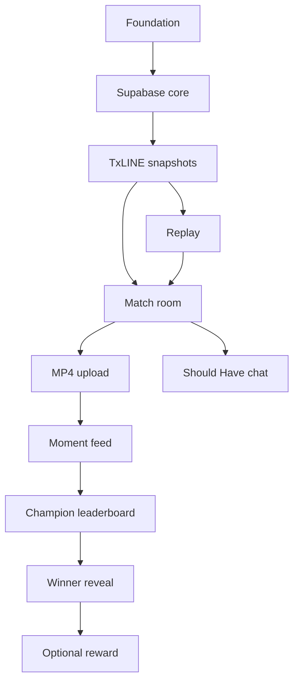

# Momento Feature Breakdown

> Momento transforms every official football event into a shared social experience where fans capture, champion and collectively decide the defining moment of every match.

## Priority labels

- **Must Have:** required for the working product and judge walkthrough.
- **Should Have:** meaningful improvement after the complete Must Have loop works.
- **Nice To Have:** impressive but immediately cuttable.
- **Demo Only:** makes the five-minute demonstration deterministic and is always labeled.
- **Future:** excluded from the 30-hour build.

## Complexity scale

- **S:** <=1 hour.
- **M:** 1-3 hours.
- **L:** 3-5 hours; split if possible.
- **XL:** must not enter the hackathon build.

## Workstreams

### 1. Project foundation — Must Have — M

- Scaffold Next.js 15, TypeScript, Tailwind, shadcn/ui and Framer Motion.
- Configure Supabase clients, environment validation and Vercel.
- Apply Momento tokens and responsive app shell.
- Done: the public shell deploys and works at mobile/desktop widths.

### 2. Database, Auth and Storage — Must Have — M

- Create only profiles, matches, official events, Moments, Champions and winner tables first.
- Add deny-by-default RLS and atomic Champion/finalize functions.
- Configure magic-link auth and a private `moments` Storage bucket.
- Backup: pre-authenticated demo accounts if email delivery is slow.

### 3. TxLINE credential setup — Must Have — M, high uncertainty

- Choose one network, subscribe, obtain guest JWT and activate API token.
- Validate one fixture snapshot and record real integration feedback.
- Backup: authorized recorded TxLINE payloads in labeled replay mode.

### 4. TxLINE snapshot adapter — Must Have — L

- Tolerant fixture and soccer-score schemas.
- Import fixture snapshots and poll the active score snapshot every 10 seconds.
- Normalize and deduplicate the events needed by the visible UI.
- Persist normalized records and one sanitized raw replay sequence.
- **Should Have:** add TxLINE SSE only after all Must Have features are deployed.

### 5. Replay harness — Demo Only — M

- Store one sanitized fixture sequence.
- Run it through the same normalizer as provider snapshots.
- Provide start, pause, next beat, final and reset controls.
- Always show the replay indicator described in `DEMO_REPLAY_SPEC.md`.

### 6. Home/lobby — Must Have — S

- One featured live/replay match and compact fixture list.
- TxLINE attribution, freshness and empty/stale fallback.
- Upcoming/recent filters are Nice To Have.

### 7. Live match room — Must Have — L

- Premium scoreboard, official event rail, data mode/freshness and responsive layout.
- Moment feed, Momentum Meter and clear Capture CTA.
- Supabase Realtime updates from stored normalized events.

### 8. Simple MP4 upload — Must Have — M

- Select an official event, choose an MP4 and validate it client-side.
- Enforce MP4 only, <=15 seconds and <=25 MB.
- Upload the original file directly to Supabase Storage and publish metadata.
- Play the stored MP4 as-is.
- No camera feature, transcoding, compression service, thumbnail worker or background processing.

### 9. Moment feed — Must Have — M

- Query by match/event and sort by new or most championed.
- MomentCard with one-active-player behavior and signed playback URL.
- Loading, empty and upload-failure states.

### 10. Champion and leaderboard — Must Have — M

- Atomic toggle, optimistic UI and final reconciliation.
- One Champion per user/Moment, five-Moment match cap and final-whistle lock.
- Live counts, Momentum Meter and top ranking.

### 11. Finalization and winner — Must Have — M

- Map TxLINE final states and lock Champion actions.
- Choose one winner deterministically and reveal the defining Moment.
- Show the linked official event and Champion total.

### 12. Live match chat — Should Have — S

- Flat match messages, Supabase Realtime and a simple rate limit.
- Desktop panel and mobile sheet.
- Moment comments are Nice To Have; threads/reactions are Future.

### 13. Trust basics — Should Have — S

- Reaction-only copyright reminder.
- One report action and admin hide path.
- Data provenance sheet with endpoint and mode truth.

### 14. Community-backed reward — Nice To Have — S

- Preconfigure the demo winner's devnet recipient address.
- One admin-confirmed sponsor transfer and Explorer link.
- No wallet onboarding, escrow, tokens or custom smart contract.
- Implement only after the non-blockchain demo is rehearsed end-to-end.

### 15. Demo controls and polish — Demo Only — M

- Seed two users and 3-5 owned reaction videos.
- Show only last TxLINE snapshot, mode and replay state in the admin panel.
- Implement the motion in `ANIMATION_SPEC.md`, responsive checks and fallback rehearsal.

### 16. Advanced product features — Future — XL

- Automated moderation, follows, notifications, personalized feeds and creator monetization.
- On-chain escrow/voting, video editing/transcoding and multi-competition recommendations.
- None may enter the 30-hour build.

## Dependency graph

## 30-hour budget

| Block | Hours | Outcome |
|---|---:|---|
| Deployed shell + Supabase | 4 | app, schema, auth and Storage |
| TxLINE snapshots + replay | 5 | official events flowing deterministically |
| Match room + home | 5 | premium responsive core screen |
| MP4 upload + feed | 4 | real publish/play flow |
| Champion + winner | 3 | differentiated social loop and payoff |
| Chat + trust basics | 2 | consumer energy and minimum safety |
| Polish, testing, video and submission | 7 | reliable public entry |

Optional SSE and reward transfer use time only if the complete loop is already green.

## Cut order if behind

1. Cut the Solana payout; retain the community winner and reward-pending copy.
2. Cut SSE; retain 10-second TxLINE score snapshot polling.
3. Cut Moment comments; retain match chat.
4. Cut the Merkle-proof drawer; retain TxLINE timestamps and attribution.
5. Cut upcoming/recent filters; retain one featured live/replay match.

Never cut: deployed URL, TxLINE-backed fixture/event flow, labeled replay, real MP4 upload, real Champion action, responsive match room, winner reveal or demo video.

## Definition of done

- Works on the deployed environment, not only localhost.
- Loading, empty, error and replay states are visible.
- Core flow works at 390px and desktop width.
- Secrets remain server-side.
- Demo script step has a rehearsed path and fallback.

