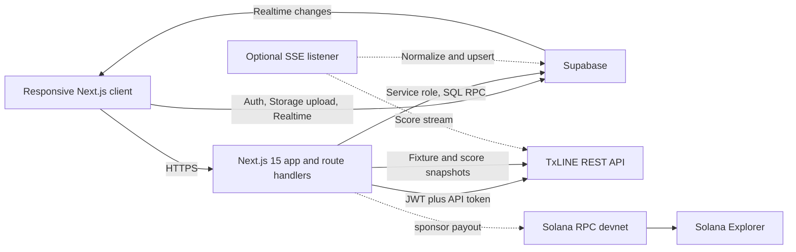
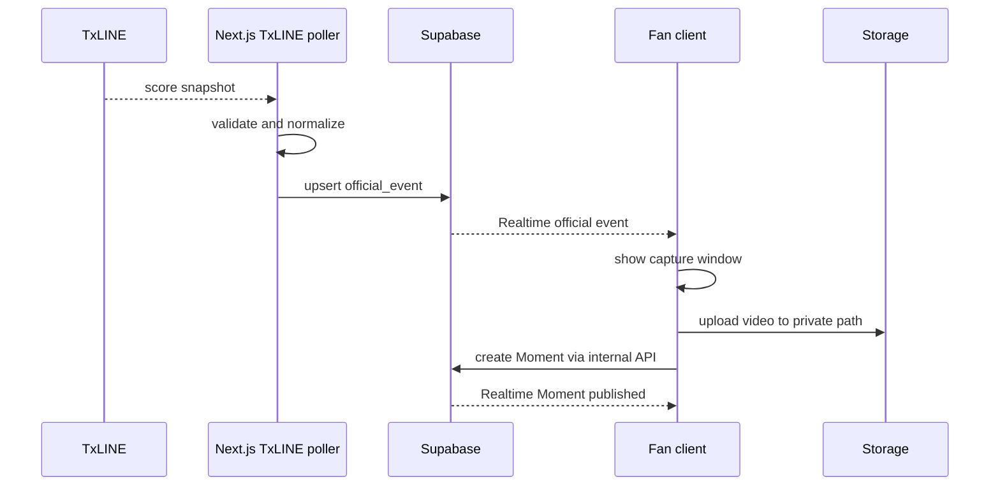
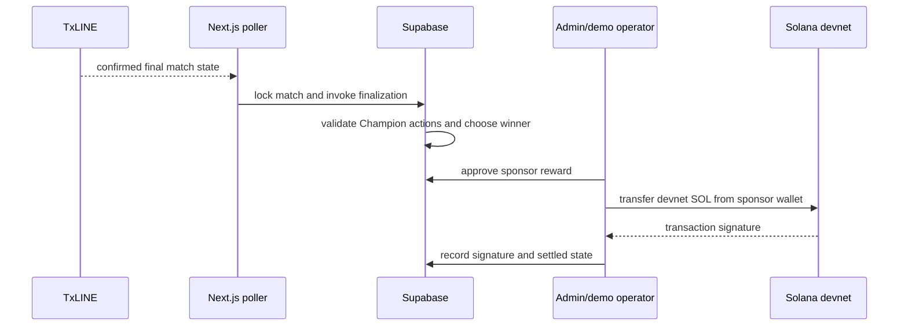

# Momento System Architecture

> Momento transforms every official football event into a shared social experience where fans capture, champion and collectively decide the defining moment of every match.

## Architecture decision

Use one Next.js application plus Supabase. Next.js owns UI, internal APIs and TxLINE snapshot polling; Supabase owns identity, PostgreSQL, Storage and Realtime. Replay uses the same normalizer as TxLINE data. A separate SSE process is optional, not required for the hackathon demo. Do not build microservices or an Anchor program.

## Deployment units

| Unit | Recommended host | Responsibility |
|---|---|---|
| Next.js app | Vercel | Pages, route handlers, TxLINE snapshot polling, replay controls, upload metadata, Champion actions, comments |
| Supabase project | Supabase | Auth, Postgres, RLS, Storage, Realtime |
| Optional SSE listener | Railway/Render only if time permits | TxLINE score stream and reconnect |
| Solana integration | Devnet RPC | One optional sponsor-funded reward transfer |

The default hackathon path polls the score snapshot every 10 seconds during an active match. This is simpler and reliable enough for the demo. Add the separate SSE listener only after the full visible product loop works.

## Frontend architecture

- Next.js App Router with Server Components for fixture discovery and match metadata.
- Client Components only for video selection, optimistic Champion actions, chat, Realtime and motion.
- TanStack Query is optional; prefer native fetch plus small hooks to reduce setup.
- A `DataModeBadge` renders `LIVE`, `CACHED`, or `REPLAY` from the API response, never client inference.
- The browser never receives `TXLINE_API_TOKEN`, Supabase service role, or sponsor key material.

## Backend boundaries

### Next.js route handlers

- Authenticate user mutations.
- Create a user-scoped Supabase Storage upload path.
- Validate Moment metadata after upload.
- Execute idempotent Champion RPC.
- Return public, normalized match data.
- Start/finalize replay sessions only for authorized demo/admin users.

### TxLINE ingestion

1. Keep the guest JWT and activated API token server-side.
2. Fetch fixture snapshot for the lobby.
3. Poll `/api/scores/snapshot/{fixtureId}` every 10 seconds while a match is active.
4. Validate, normalize, deduplicate and store the official event.
5. Mark data freshness and update fixture state.
6. Trigger finalization when a confirmed final state is observed.
7. **Should Have:** replace polling with `/api/scores/stream` and resume using `Last-Event-ID`.

### Supabase

- Realtime publications: `official_events`, `moments`, `moment_champions`, `comments`, `match_messages`, `matches`.
- Storage bucket `moments` is private; use signed playback URLs.
- Database functions enforce Champion idempotency and winner finalization.

## Data flow: official event to Moment

## Upload flow

1. Client accepts **MP4 only** and checks duration <=15 seconds and size <=25 MB.
2. `POST /api/uploads/intent` returns a user-scoped Supabase Storage path.
3. Client uploads the original MP4 directly to Supabase Storage.
4. Client calls `POST /api/moments` with the storage path and official event ID.
5. Server re-checks ownership, MP4 MIME type, object size, event/match relationship and capture window.
6. The Moment publishes immediately for the demo.

There is no transcoding pipeline, compression service, thumbnail worker or background media processing.

## Reward flow

Community selection is entirely off-chain. The only optional blockchain action is one fixed sponsor-to-winner devnet transfer after finalization. If it fails, show `Winner confirmed — reward pending`; the core experience remains complete.

## TxLINE authentication architecture

- Use one network consistently: devnet is recommended for subscription setup and demo transactions; mainnet service level 12 is preferable only if credentials are already active.
- Free access still requires an on-chain subscription transaction and SOL for fees/rent.
- Credentials are configured once server-side; end users do not subscribe to TxLINE.
- Store guest JWT expiry and rotate before 30 days; never log tokens.

## Replay architecture

Replay is a first-class reliability mode, not fake live data.

- Store a recorded array of TxLINE-shaped payloads with original `ts`, `seq`, and fixture IDs.
- An admin-only runner emits records at controlled offsets into the same normalization path used by score snapshots.
- Set `matches.data_mode = replay`; render `Demo replay • recorded TxLINE data`.
- Reset deletes only demo-generated events/Moments associated with the replay session, never production records.

## Caching and freshness

- Fixture snapshot cache: 5 minutes normally, 30 seconds from 30 minutes before kickoff through final.
- Score snapshot cache: 10 seconds for active matches, 1 hour for final matches.
- Home responses may use stale-while-revalidate for 60 seconds.
- `last_provider_update_at` and `last_ingested_at` are distinct to reveal upstream vs pipeline delay.
- Mark stale after 30 seconds in real-time mode or 120 seconds in delayed tier.

## Security and abuse controls

- RLS is deny-by-default; service role is server-only.
- Validate all public IDs as UUIDs or safe 64-bit numeric strings.
- Idempotency keys on Moment publish, Champion, replay start and reward settlement.
- Rate-limit comments, Champion toggles and upload intents.
- Signed Storage URLs expire within 15 minutes; refresh transparently.
- Sponsor private key is a deployment secret, preferably a low-value devnet key isolated to settlement.
- Log administrative hides, finalization, replay control, and reward actions.

## Hackathon diagnostics

- Log only fixture ID, provider event identity, mode and safe error code.
- A small admin status panel reports the last successful TxLINE snapshot and replay state.
- Do not build a monitoring stack, ingest dashboard or alerting service during the hackathon.

## Failure modes

| Failure | User behavior | System action |
|---|---|---|
| Optional TxLINE SSE disconnect | Existing content remains | Return to 10-second score snapshot polling |
| Credentials rejected | Switch to cached/replay; no fabricated `LIVE` label | Alert operator; suppress retries after backoff ceiling |
| Supabase Realtime drops | Poll current match every 15 seconds | Re-subscribe on focus/network recovery |
| Upload fails | Preserve form; show retry | Retry direct upload; remove orphan manually before submission if needed |
| Duplicate Champion | No count inflation | Unique constraint plus idempotent RPC |
| Finalization races | `Finalizing` state | Transaction lock on match row |
| Solana transfer fails | Winner still visible; reward `pending` | Retry only with same idempotency key |
