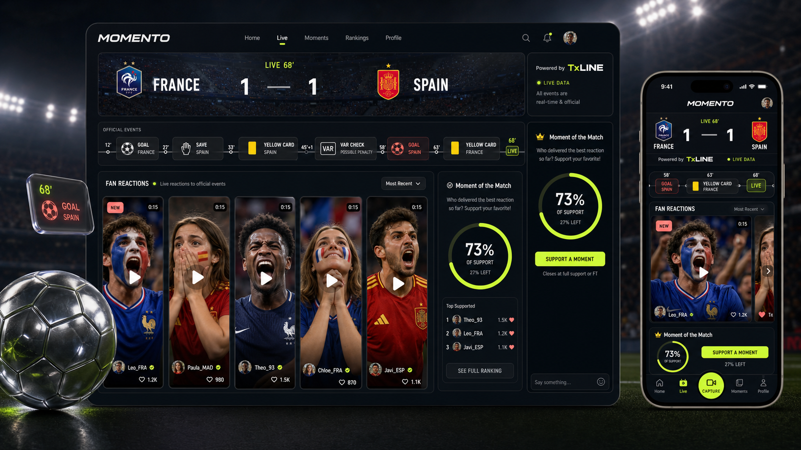

# Momento UI and UX Specification

> **Experience promise:** Momento transforms every official football event into a shared social experience where fans capture, champion and collectively decide the defining moment of every match.

## Experience direction

Momento should feel like a night-match broadcast fused with a creator feed: fast, emotional and legible. Official TxLINE facts create the shared match context; fan Moments make that context social. The core emotional sequence is **official event -> capture -> Champion -> defining Moment**.

Visual reference: [generated desktop/mobile concept](docs/assets/momento-ui-concept.png). It is directional; do not copy team crests or generated faces/assets into production without rights.

## Information architecture

### Mobile bottom navigation

- Home
- Live
- **Capture** central action
- Moments
- Profile

### Desktop navigation

- Momento wordmark
- Home, Live, Moments
- Search (post-MVP or disabled for demo)
- Data status
- Profile/avatar

## Global interaction rules

- Authentication is deferred until publish, Champion or comment.
- Every sports-data surface shows mode: live, cached, or replay.
- Official events use fixed iconography and neutral surfaces; UGC uses video imagery.
- Respect `prefers-reduced-motion`; never animate score changes in a way that obscures data.
- All destructive actions require confirmation or undo.
- Toasts are secondary; inline status carries essential information.

## Screen 1: Home / Match Lobby

**Purpose:** let users select an active, upcoming, or recently completed covered match.

**Components:** compact header, featured live match, segmented filter, fixture list, replay-demo callout, TxLINE data explainer.

**Primary states:**

- Live fixtures: score/state/freshness, active Moment count.
- Upcoming: kickoff countdown and `Remind me` disabled/post-MVP.
- Recent: final score and winning Moment preview.
- Replay: clearly labeled recorded TxLINE data and `Start demo` for authorized operator.

**Loading:** scoreboard-shaped skeletons; no generic full-page spinner.

**Empty:** `No covered match is live right now` plus next fixture and demo replay CTA.

**Error:** last successful fixtures with stale timestamp; if absent, replay CTA.

**Motion:** featured match glow gently intensifies when state becomes live; 200 ms list transitions.

**Responsive:** one column under 768px; featured plus compact list at tablet; 12-column layout at desktop with max width 1440px.

## Screen 2: Live Match Room

**Purpose:** make the official match timeline and fan response loop understandable in seconds.

**Desktop layout:**

1. Sticky compact match header.
2. Full-width official event rail.
3. Main column: filterable horizontal/vertical Moment feed.
4. Right rail: Moment of the Match meter and live chat.

**Mobile layout:**

1. Sticky score header.
2. Horizontally scrollable event rail with active event centered.
3. Snap-scrolling vertical Moment cards.
4. Collapsible ranking sheet.
5. Persistent central Capture action above bottom navigation.

**Components:** MatchScoreboard, DataModeBadge, OfficialEventRail, CaptureWindowBanner, MomentCard, ChampionButton, MomentumMeter, ChatPanel.

**States:** pre-match, live first half, halftime, second half, extra time, penalties, final, interrupted/postponed, stale/reconnecting, replay.

**Loading:** header appears from match cache; event rail skeleton; Moments load independently.

**Empty Moments:** event-specific prompt: `Be the first to capture this moment`.

**Error:** non-blocking provider banner; existing UGC remains usable unless match integrity requires locking capture.

**Motion:** new confirmed event enters rail with a 350 ms slide and subtle pulse; score digit cross-fades; Capture button performs one spring pulse. No confetti until winner finalization.

**Accessibility:** aria-live polite for score/state, assertive only for final; event icons always have labels; chat does not steal focus.

## Screen 3: Capture Event Picker

**Purpose:** select the official event that contextualizes a new Moment.

**Components:** bottom sheet/modal, eligible event list, countdown, event details, copyright reminder.

**Rules:** preselect the latest eligible confirmed event; unavailable/retracted events cannot be selected; replay mode removes urgency but retains original minute.

**Empty:** no eligible event yet; allow camera preview only, not publish.

**Responsive:** full-height sheet on mobile; centered 560px dialog on desktop.

## Screen 4: Record / Upload

**Purpose:** capture or select a <=15-second reaction.

**Components:** MP4 file input, preview, 15-second ring, replace action, metadata form, upload progress, publish CTA.

**Flow:** select -> validate -> preview -> title/caption -> upload -> publish -> success card.

**Validation:** MP4 only, <=15 seconds, <=25 MB, selected event and title length. Errors sit next to the offending field and preserve work.

**Loading:** determinate upload progress; `Publishing…` is a separate final state.

**Error recovery:** preserve the form and let the fan retry the direct Supabase Storage upload. The original MP4 is used as-is; there is no transcoding, compression or background processing.

**Responsive:** edge-to-edge preview mobile; split preview/form desktop.

## Screen 5: Moment Detail

**Purpose:** focus on one video, its official context, Champion action and discussion.

**Components:** VideoPlayer, event context chip, creator info, ChampionButton, Champion count/rank, comments, report/share menu.

**States:** published, winner, creator-owned, hidden (owner sees reason), video unavailable.

**Empty comments:** `Start the conversation about this reaction`.

**Motion:** Champion confirmation produces a small crest/radial fill defined in `ANIMATION_SPEC.md`; autoplay is muted and only when sufficiently visible.

**Responsive:** full-bleed video and sheet content mobile; two-column video/comments desktop.

## Screen 6: Moments / Leaderboard

**Purpose:** compare top reactions without encouraging financial-market behavior.

**Components:** match picker, ranking list, top three editorial treatment, event filters, rule explainer.

**Copy:** use `Most championed`, `Community rank`, `Champion closes at final whistle`. Do not use back, odds, price, position, profit or yield.

**State:** live ranks can change; final ranks are locked and include winner badge.

**Responsive:** dense list mobile; top-three cards plus list desktop.

## Screen 7: Winner / Match Recap

**Purpose:** deliver the emotional payoff and TxLINE-backed finality.

**Components:** final scoreboard, winning Moment, creator, Champion total, linked official event, reward state, TxLINE provenance and optional explorer link.

**Animation:** short restrained crown/reveal, 700 ms maximum; reduced-motion version is instant.

**Fallback:** reward pending does not diminish winner declaration.

## Screen 8: Profile

**Purpose:** show identity, created Moments, wins and championed Moments.

**Components:** avatar/handle, stats, tabbed content and moderation notices. A reward address is an optional plain profile setting, not part of the core demo.

**Empty:** friendly creator prompt with direct Capture route to an active match.

## Screen 9: Authentication

**Purpose:** create minimal friction at the point of intent.

Use a bottom sheet/dialog with email magic link and optional social provider only if already configured. Explain the action being preserved (`Sign in to publish your Moment`). Restore the pending destination/form after callback.

## Screen 10: Data Provenance / About

**Purpose:** make TxLINE's contribution obvious to judges and users.

Show:

- current data mode and last update;
- fixtures, score snapshot, score stream, and optional proof endpoint descriptions;
- `Official data` vs `Fan-created content` legend;
- a concise architecture diagram;
- TxLINE/TxODDS attribution and disclaimer.

## Screen 11: Demo Control (admin-only)

**Purpose:** run a deterministic five-minute presentation.

Controls: reset fixture, start/pause replay, next beat and jump to final. This route is excluded from normal navigation and protected by one demo-admin check. See `DEMO_REPLAY_SPEC.md`.

## Responsive breakpoints

| Range | Behavior |
|---|---|
| 320-479px | one Moment per viewport, bottom navigation, compact score |
| 480-767px | larger video card, event rail remains horizontal |
| 768-1023px | two-column feed/ranking where space permits |
| 1024-1439px | desktop navigation, main + 320px side rail |
| 1440px+ | capped canvas, no uncontrolled line growth |

## UX acceptance checklist

- Core capture flow completes with one thumb on 390x844.
- No primary action depends on hover.
- Visible focus rings and logical keyboard order.
- Color is never the only live/error/selection signal.
- All video has captions field/post-MVP transcript notice and never autoplays with sound.
- Screen remains useful under cached/replay modes.
- Wallet is absent from the home hero and primary navigation.
