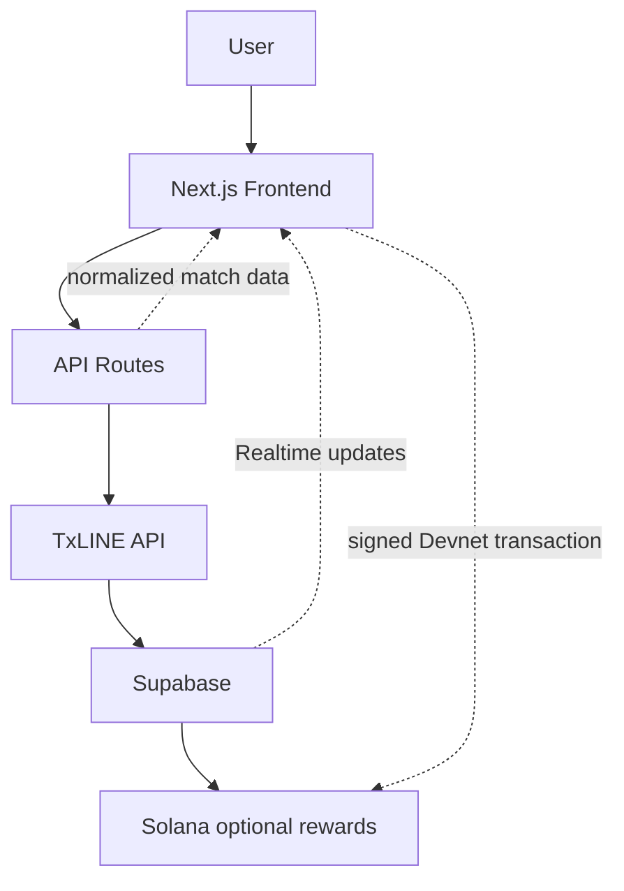
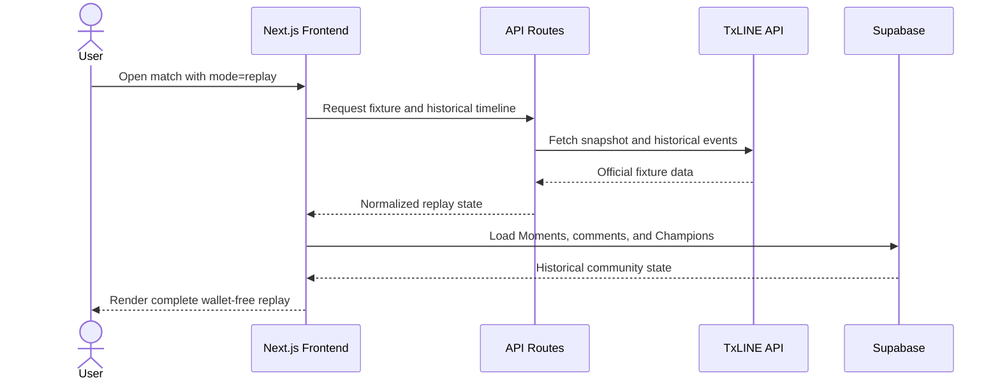
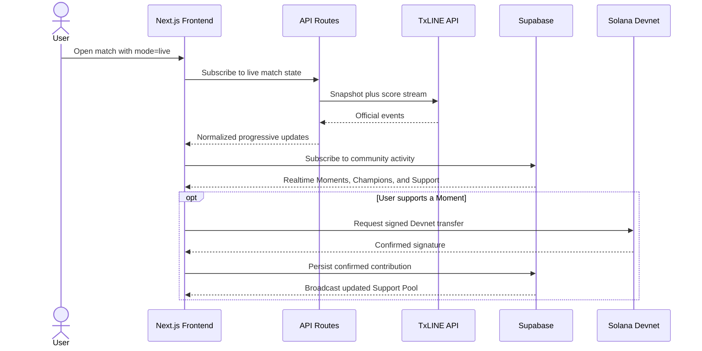
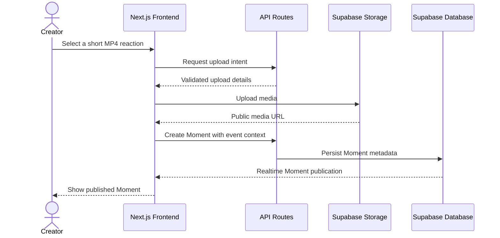
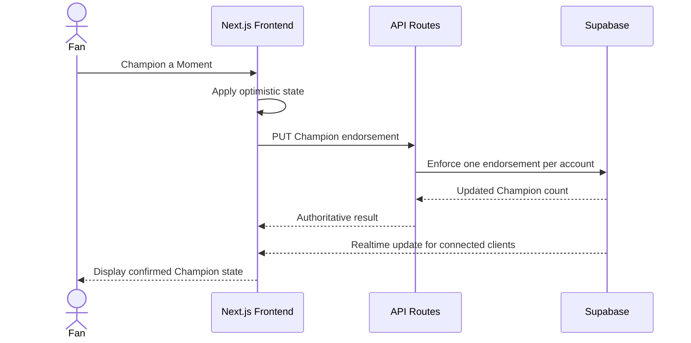

# Momento Architecture Diagrams

These Mermaid diagrams render natively on GitHub and describe the primary system path and the four judge-critical flows.

## System architecture

> The vertical solid path is the requested high-level judging view. Dashed edges clarify runtime responses: Next.js normalizes TxLINE data, Supabase publishes community updates, and the browser signs optional Solana transactions.

## Replay Mode

## Live Mode

## Upload Flow

## Champion Flow

## Related documentation

- [Architecture](Architecture.md)
- [API](API.md)
- [TxLINE](TxLINE.md)
- [Database](Database.md)
