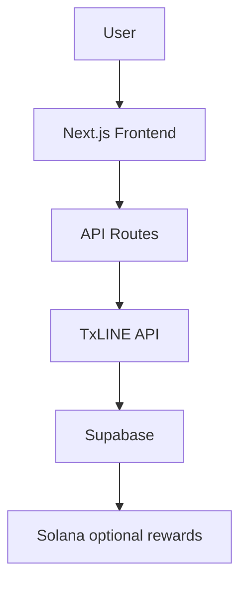

# Momento
> **Documentation index:** [Live deployment](https://themomento.xyz) · [GitHub repository](https://github.com/WorldsBestSoftwareDeveloper/momento) · [Judge demo](Demo.md)

Momento transforms live football moments into community-supported opinion markets. Fans follow official match events, upload short reaction videos, **Champion** the Moments they love, and financially **Support** the Moments they believe will define the match through real Solana Devnet transactions.

Built for the TxLINE Consumer & Fan Experiences Hackathon, Momento turns a match feed into a synchronized social experience: official events unlock fan reactions, community activity shapes visibility, and SOL-backed Support determines the winning Moment.

> **Core idea:** Every official football event becomes a shared social experience where fans capture, Champion, and collectively decide the defining Moment of the match.
## Documentation map

| Document | Purpose |
| --- | --- |
| [Architecture](Architecture.md) | System boundaries, data flows, security, and failure modes |
| [Architecture diagrams](ARCHITECTURE_DIAGRAM.md) | GitHub-renderable system and sequence diagrams |
| [API](API.md) | Internal route contracts, validation, and Realtime channels |
| [TxLINE](TxLINE.md) | Authentication, endpoints, normalization, replay, and failure handling |
| [Database](Database.md) | Entities, tables, functions, retention, and RLS policies |
| [Demo](Demo.md) | Judge narrative, walkthrough, contingency plan, and submission checklist |
| [Deployment](Deployment.md) | Vercel, Supabase, TxLINE, Solana, and production validation |
| [Deep-dive references](reference/README.md) | Product, design, implementation, replay, wallet, and risk specifications |

## Architecture diagram



See the [complete architecture diagram](ARCHITECTURE_DIAGRAM.md) for Replay, Live, Upload, and Champion sequence diagrams.

## Demo Overview

Momento provides two presentations of the same canonical match room. Both modes share the same route, Moments, comments, rankings, and community data; only the match state and transaction permissions change.

- Historical Replay: `/matches/france-spain-demo?mode=replay`
- Live Match: `/matches/france-spain-demo?mode=live`

### Historical Replay

Historical Replay presents an archived match as a complete product experience:

- Official historical match data
- Completed official timeline
- Every published Moment available immediately
- Comments, rankings, and historical community activity
- Free Champion endorsements
- No wallet required
- No blockchain transactions
- A clear **Watch Live & Support** path into Live Match

### Live Match

Live Match compresses the full match experience into an approximately 48-second judge walkthrough:

- Starts from kickoff instead of the final result
- Official timeline progresses automatically
- Events, reactions, rankings, and community activity appear progressively
- New Moments unlock as the match advances
- Champion Moments for free
- Support Moments using real Solana Devnet transactions
- Supabase Realtime updates connected clients
- Final whistle triggers settlement presentation and the winning Moment

## Core Features

- Official TxLINE fixture, score, historical replay, and live event data
- Historical Replay and Live Match modes on one canonical route
- Community-created 15-second MP4 Moments
- Public MP4 playback on desktop and mobile
- Supabase Storage-backed media uploads
- Supabase Realtime comments, Moments, Champions, and Support activity
- Per-Moment discussions rather than one global chat
- Community-backed Opinion Market
- Free, one-per-account Champion system
- SOL-backed Support Pools
- Official Solana Wallet Adapter integration
- Solana Devnet treasury transfers and Explorer receipts
- Creator reward experience with safe public-deployment controls
- Global search across matches, Moments, and creators
- Creator profiles and activity history
- Responsive sports-broadcast UI for desktop, tablet, and mobile

## Opinion Market

The Opinion Market separates social appreciation from financial conviction.

### Champion

Champion is Momento's free community endorsement:

- Free
- One endorsement per account
- Measures community popularity
- Improves community visibility
- No wallet required
- Never adds SOL to a Support Pool

### Support

Support financially backs a Moment:

- Sends real Devnet SOL to the configured treasury
- Requires a connected wallet and explicit signature
- Funds that Moment's Support Pool
- Persists the confirmed contribution in Supabase
- Updates connected clients through Supabase Realtime
- Is available only in Live Match

### Settlement

The **Winning Moment** is the Moment with the largest Support Pool when the match settles.

| Distribution | Recipient |
| ---: | --- |
| 70% | Winning creator |
| 20% | Fans who supported the Winning Moment |
| 10% | Treasury reserve |

Champion influences community appreciation and visibility. Support determines the financial result and settlement ranking.

## Tech Stack

| Layer | Technology |
| --- | --- |
| Application | Next.js 15, React 19, TypeScript |
| Styling | Custom tokenized CSS design system, responsive media queries |
| Motion and icons | Framer Motion, Lucide React |
| Database and authentication | Supabase |
| Media | Supabase Storage |
| Realtime | Supabase Realtime |
| Wallet | Solana Wallet Adapter |
| Blockchain | Solana Web3.js on Devnet |
| Sports data | TxLINE APIs and SSE |
| Hosting | Vercel |

> The current repository uses a custom design system in `app/globals.css`; Tailwind CSS is not a runtime dependency and is not required to run the project.

## Architecture

Momento keeps raw integrations behind normalized services so the UI remains unchanged when switching between Historical Replay and Live Match.

### Frontend

Next.js App Router and React render the Homepage, canonical Match room, Search, Profile, Rewards, and Treasury experiences. A shared canonical match-state provider owns the active mode, score, minute, status, event timeline, unlocked Moments, and settlement state across the application.

### Backend

Next.js server routes proxy TxLINE snapshot and SSE data. TxLINE credentials remain server-only, and React components consume normalized Momento match models rather than raw provider payloads.

Supabase repositories sit behind service interfaces for Moments, comments, Champions, Support contributions, and activity.

### Storage

Uploaded MP4 files are stored in a public Supabase Storage bucket. The resulting public URL is persisted with the Moment so connected clients can play the same media without relying on local object URLs.

### Realtime

Supabase Realtime subscriptions distribute:

- New Moments
- Comments
- Champion changes
- Confirmed Support contributions
- Opinion Market pool updates

Optimistic state keeps interactions immediate while authoritative refreshes prevent subscription-race inconsistencies.

### Wallet

The official Solana Wallet Adapter provides browser-wallet connectivity. Wallet access is optional for social features and is exposed only where a signed Devnet transaction is required.

### Blockchain

Live Support creates a real Solana Devnet transfer from the connected fan wallet to the configured treasury. The confirmed signature is persisted and linked to Solana Explorer. Historical Replay never requests a wallet or sends a transaction.

## Setup

### Requirements

- Node.js 20 or later
- npm
- A Supabase project for cross-device persistence and Realtime
- TxLINE Devnet credentials for authenticated data
- A Solana Devnet wallet and treasury address for live Support

### Install and start

```bash
npm install
cp .env.example .env.local
npm run dev
```

On PowerShell:

```powershell
npm install
Copy-Item .env.example .env.local
npm run dev
```

Open [http://localhost:3000](http://localhost:3000).

### Environment variables

Never commit `.env.local`, wallet secret keys, seed phrases, service-role keys, Guest JWTs, or API tokens.

| Variable | Required | Purpose |
| --- | --- | --- |
| `NEXT_PUBLIC_APP_URL` | Recommended | Public application origin, such as `http://localhost:3000` locally. |
| `NEXT_PUBLIC_SUPABASE_URL` | For shared data | Public Supabase project URL. |
| `NEXT_PUBLIC_SUPABASE_ANON_KEY` | For shared data | Public Supabase anonymous key. Never use the service-role key in the browser. |
| `NEXT_PUBLIC_SOLANA_RPC_URL` | For wallet flows | Solana Devnet RPC endpoint. Defaults to the public Devnet cluster. |
| `NEXT_PUBLIC_TREASURY_ADDRESS` | For Live Support | Public Devnet treasury address that receives Support transfers. |
| `NEXT_PUBLIC_REWARDS_ENABLED` | Optional | Set to `true` only in a controlled deployment where reward claiming is intentionally enabled. |
| `NEXT_PUBLIC_REWARD_AMOUNT_SOL` | Optional | Creator reward amount displayed by the reward experience. |
| `NEXT_PUBLIC_REWARD_CREATOR_WALLET` | Optional | Restricts a reward to the expected creator wallet. |
| `OPINION_MARKET_ENABLED` | Recommended | Enables the Opinion Market experience. |
| `DEMO_MODE` | Recommended | `true` defaults navigation to Historical Replay; `false` defaults to Live Match. |
| `DEMO_REPLAY_ENABLED` | Optional | Enables the deterministic historical presentation. |
| `DEMO_FIXTURE_ID` | Recommended | Canonical public match slug. Use `france-spain-demo` for the submission experience. |
| `TXLINE_NETWORK` | TxLINE activation | Use `devnet` for the hackathon environment. |
| `TXLINE_RPC_URL` | TxLINE activation | Devnet RPC used by the activation script. |
| `TXLINE_API_ORIGIN` | TxLINE | TxLINE Devnet origin: `https://txline-dev.txodds.com`. |
| `TXLINE_FIXTURE_ID` | TxLINE | Internal TxLINE fixture ID. It must never replace the canonical public route. |
| `TXLINE_WALLET_PATH` | Activation only | Local path to the Devnet activation wallet JSON. Never deploy this file. |
| `TXLINE_SUBSCRIPTION_TX_SIG` | Activation retry | Existing subscription transaction signature, if the on-chain step already succeeded. |
| `TXLINE_GUEST_JWT` | TxLINE | Server-only Guest JWT printed by activation. Never prefix with `NEXT_PUBLIC_`. |
| `TXLINE_API_TOKEN` | TxLINE | Server-only activated TxLINE API token. Never prefix with `NEXT_PUBLIC_`. |
| `TREASURY_WALLET_PATH` | Local setup only | Optional path used by the treasury setup script; defaults inside the gitignored `.secrets` directory. |

### TxLINE activation

The activation script targets Devnet, Service Level 1, four weeks, and `SELECTED_LEAGUES=[]`. It saves nothing automatically and prints the credentials for manual storage.

```bash
npx tsx scripts/activate-txline.ts
```

For the complete wallet and TxLINE setup, see [wallet setup](reference/WALLET_SETUP.md), [TxLINE integration](TxLINE.md), and [judge setup](reference/JUDGE_SETUP.md).

### Validation

```bash
npm run typecheck
npm run lint
npm run build
```

## Deployment instructions

### 1. Deploy to Vercel

1. Import the GitHub repository into Vercel.
2. Configure the environment variables from `.env.example`.
3. Keep `TXLINE_GUEST_JWT` and `TXLINE_API_TOKEN` server-only.
4. Set `NEXT_PUBLIC_APP_URL` to the production domain.
5. Deploy and verify both canonical mode URLs.

### 2. Configure Supabase

1. Create a Supabase project.
2. Apply the SQL migrations in [`supabase/migrations`](../supabase/migrations/).
3. Enable the required tables in the Supabase Realtime publication.
4. Create the public Moment-media Storage bucket and apply its upload/read policies.
5. Add only the project URL and public anonymous key to Vercel.
6. Never expose a Supabase service-role key.

If Supabase is unavailable, Momento falls back to local repositories instead of crashing; cross-device persistence and Realtime require Supabase.

### 3. Configure Wallet Adapter

Set `NEXT_PUBLIC_SOLANA_RPC_URL` to a reliable Devnet RPC. Users connect through supported Wallet Adapter wallets and approve every transaction explicitly.

### 4. Configure the Devnet treasury

Create or reuse a dedicated Devnet treasury:

```bash
npm run treasury:setup
```

Fund the printed public address with Devnet SOL, then set it as `NEXT_PUBLIC_TREASURY_ADDRESS`. Never deploy the treasury keypair or place a private key in a `NEXT_PUBLIC_` variable.

### 5. Configure TxLINE

Add the activated Guest JWT, API token, internal fixture ID, and Devnet API origin to Vercel. The browser continues to use the canonical route `/matches/france-spain-demo`; the numeric TxLINE fixture ID is used only by server-side API requests.

## Screenshots

Replace these judge-safe placeholders with final screenshots or animated GIFs before submission. Recommended GIFs: the replay-to-live switch, Moment upload, Champion interaction, and confirmed Solana Support flow.

### Homepage


### Historical Replay


### Live Match


### Opinion Market


### Profile


### Rewards


## Demo Flow

A complete judge walkthrough takes approximately 60 seconds:

1. **Open the Homepage.** Introduce Momento as the social layer for official football events.
2. **Enter Historical Replay.** Show the complete official timeline, all fan Moments, comments, rankings, and historical community support.
3. **Switch to Live Match.** The canonical route remains unchanged while the match resets to kickoff.
4. **Watch Moments unlock.** Official events advance automatically and new community reactions appear with the timeline.
5. **Champion a Moment.** Demonstrate the free, walletless popularity signal.
6. **Support a Moment.** Open the Support sheet, choose an amount, and connect a Devnet wallet.
7. **Approve the transaction.** Sign the real Devnet SOL transfer and open its Explorer receipt.
8. **Watch Realtime update.** Show the Support Pool, activity, and connected client updating.
9. **Open Rewards.** Explain settlement, the winning creator, and the safe public-deployment reward state.

## Future Work

- Solana Mainnet support
- Multiple simultaneous matches
- AI-assisted Moment ranking and discovery
- Expanded creator monetization
- League and tournament support
- NFT achievements and collectible match memories
- Automated video transcoding and adaptive streaming
- Production treasury settlement service

## Credits

Momento was built with:

- [OpenAI Codex](https://openai.com/codex/) for implementation collaboration
- [TxLINE](https://txline.txodds.com/documentation/quickstart) for official football data and live event infrastructure
- [TxLINE World Cup documentation](https://txline.txodds.com/documentation/worldcup) for the hackathon integration
- [Supabase](https://supabase.com/) for database, Storage, authentication, and Realtime
- [Solana](https://solana.com/) for Devnet wallet transactions and treasury settlement
- [Vercel](https://vercel.com/) for deployment
- [Next.js](https://nextjs.org/) and [React](https://react.dev/) for the application framework

---

Momento transforms official football data into shared emotion, community conviction, and a transparent path to the defining Moment of every match.
