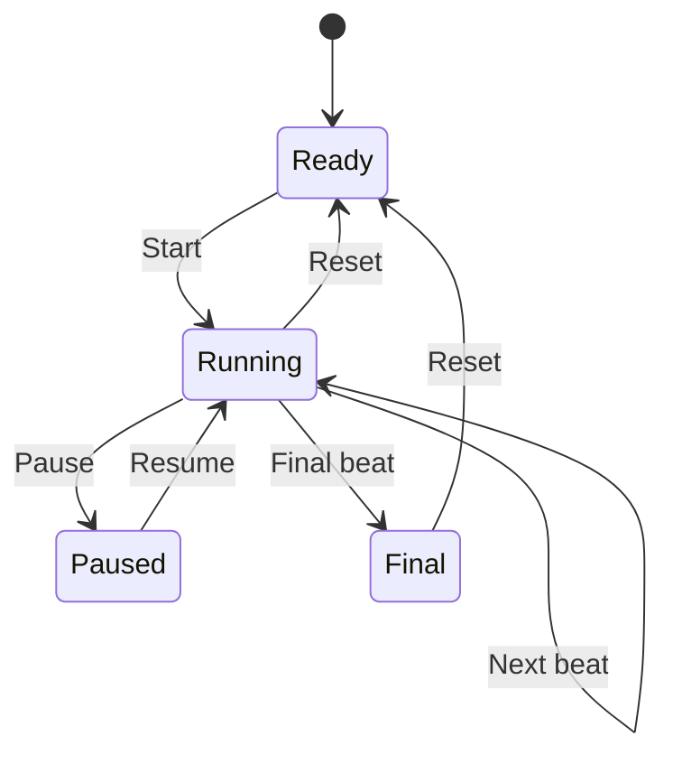

# Momento Demo Replay Specification

> Replay makes the TxLINE-powered product demonstrable at any judging time. It is deterministic, uses captured authorized TxLINE data and is visibly distinct from a live match.

## Purpose

The World Cup schedule, network health and judging time cannot be controlled. Replay reproduces the complete official-event-to-Capture-to-Champion-to-winner story without claiming that recorded events are live.

Replay is **Demo Only** but runs through the same event normalizer, Supabase records and UI components as live/snapshot mode.

## Data source

- One fixture snapshot captured through the team's TxLINE access.
- One ordered score-event sequence for the same fixture, ideally containing match start, goal, card or VAR, second goal and final state.
- Preserve TxLINE fixture ID, event/action ID, sequence, original provider timestamp, match minute, confirmation state and score fields.
- Remove credentials, guest JWT, API token, wallet material and unrelated payload fields.
- Confirm TxLINE terms permit retaining/using the captured data for the hackathon demo.

Fan accounts, Moments, Champion actions and chat messages are synthetic/owned demo content and are never represented as TxLINE data.

## Replay modes

### Guided mode — default for recording

The operator advances named beats manually. This avoids timing drift while narrating.

### Timed mode — optional

Events emit at compressed offsets, default `8x`. Pause/resume preserves the cursor. Guided mode remains the fallback.

## Replay timeline

| Replay beat | Demo time | Official data action | Visible product response |
|---|---:|---|---|
| Ready | before 0:00 | Seed fixture in pre-match/active state | Lobby card shows `REPLAY` and recorded-data copy |
| Kickoff | 0:30 | Emit active phase | Match room shows official state and timeline |
| Goal | 0:55 | Emit confirmed goal and score update | Goal animation, event token, Capture CTA pulse |
| Fan capture | 1:20 | No provider mutation | Operator uploads a real MP4 linked to goal |
| Champion | 2:10 | No provider mutation | Second fan champions; meter and leaderboard update |
| Secondary event | 2:45 | Emit card/VAR/save as available | Demonstrates more than one official event type |
| Final whistle | 3:25 | Emit confirmed `F`, `FET` or `FPE` | Champion locks and winner selection runs |
| Winner | 3:35 | No provider mutation | Defining Moment reveal and optional reward state |

The replay cursor advances independently from the video narration clock; the table describes the desired recording rhythm.

## State model

## Controls

The protected demo panel contains only:

- **Reset:** remove replay-session events and restore seed Moments/Champion counts.
- **Start:** enter replay and emit the first beat.
- **Pause/Resume:** timed mode only.
- **Next beat:** emit exactly one named official event.
- **Jump to final:** emit remaining required state and final whistle safely.
- **Speed:** optional `1x`, `4x`, `8x`; hidden during the recorded demo.

Controls are idempotent. Pressing a completed beat again must not duplicate its official event or score.

## Visual indicators

Replay must never visually impersonate live data.

### Persistent indicators

- Header badge: `REPLAY` with play-history icon, never lime `LIVE`.
- Subtext: `Recorded TxLINE match data`.
- Timestamp: `Original event time` in the provenance sheet.
- Match room background may use a neutral violet/blue indicator accent distinct from the lime live state.

### First-entry disclosure

Show a compact non-blocking banner:

> Demo replay — official events were previously captured from TxLINE and are being replayed through Momento's live event pipeline.

The banner may be dismissed, but the header badge remains.

### Judge proof

The Data Provenance sheet explicitly shows:

- Mode: Replay.
- Source: Recorded TxLINE fixture and score data.
- Original fixture ID and event timestamps.
- Same normalizer/database/UI path used by snapshot mode.
- No claim that the current wall-clock event is live.

## Event processing

1. Operator starts a `replay_session` with a selected fixture and cursor 0.
2. The next recorded record is passed to the production TxLINE normalizer.
3. Normalized official event and match state are upserted using the provider key.
4. Supabase Realtime fans the database change to clients.
5. Client runs normal score/event/Capture motion with replay styling.
6. Cursor records the completed beat so retrying is safe.

Replay must not contain a separate UI-only mock event path.

## Reset behavior

- Scope every synthetic write to the replay session or known demo fixture.
- Restore match score/state, event cursor, winner and Champion counts to the seed baseline.
- Keep fixture ID and seed media stable.
- Never delete non-demo user data or production fixtures.
- Verify reset once before every recording take.

## Fallback strategy

| Failure | Fallback |
|---|---|
| TxLINE credentials unavailable | Run replay and state the integration setup friction honestly |
| Live match absent | Use guided replay; this is the expected judging path |
| Snapshot/API becomes unavailable mid-demo | Keep last-known UI, switch to replay after explicit mode change |
| Timed replay drifts | Pause and use `Next beat` |
| One replay event fails normalization | Skip to the next validated beat; never fabricate a live label |
| Realtime delivery drops | Refetch the match after the upsert; guided controls remain paused |
| Finalization fails | Use reset, verify seed winner logic and re-run before recording |

## Acceptance criteria

- `REPLAY` is visible on Home, match header and provenance sheet.
- Official records retain TxLINE identity and original time.
- Same normalizer produces snapshot and replay UI models.
- Each guided control is idempotent.
- Reset returns to the same seed state in under five seconds.
- Goal, Capture, Champion, final whistle and winner can be rehearsed three times consecutively.
- No secret or private payload is stored in replay fixtures.
