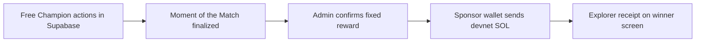

# Momento Lightweight Solana Architecture

> The community decides the defining Moment through free Champion actions. Solana demonstrates the reward outcome without controlling the social experience.

## Decision

Blockchain is intentionally limited to two facts:

1. TxLINE itself requires the operator's matching-network subscription transaction.
2. Momento may show **one fixed sponsor-funded devnet transfer** to the winning creator.

Champion actions, rankings and winner selection remain in Supabase. Do not build Anchor, escrow, tokens, NFTs, deposits, prize-pool contracts or on-chain voting.

## Simplest reward architecture

## Demo configuration

- Store a devnet recipient address on the seeded creator profile.
- Fund one low-value sponsor devnet wallet.
- Keep the sponsor key only in a server secret.
- Configure one fixed amount in environment settings.
- Expose one protected `Send reward` admin action after finalization.

There is no user wallet onboarding in the Must Have flow. If a live creator needs to provide a wallet, an admin may enter/verify it outside the five-minute demo. Wallet Adapter is Future unless already working for free.

## Settlement flow

1. TxLINE final state locks Champion actions.
2. Supabase selects the eligible Moment with the highest Champion count.
3. Winner screen appears immediately, independent of Solana.
4. Admin reviews winner, fixed amount and preconfigured devnet recipient.
5. Server submits one System Program transfer.
6. Store the signature and show its devnet Explorer link.

## Minimum safety

- Unique reward row per match.
- Disable the action after a signature is recorded.
- If submission status is uncertain, inspect the signature; never blindly resend.
- Hard-cap the amount in server configuration.
- Never accept or expose a private key through an API response.
- Reward failure must never alter the selected winner.

## Failure states

| State | User-facing result |
|---|---|
| Reward not implemented | `Community winner confirmed` with no blockchain claim |
| Recipient missing | `Reward pending` |
| RPC unavailable | `Reward pending — community result is final` |
| Submitted | `Reward processing` and abbreviated signature |
| Confirmed | `Reward sent` and Explorer link |

## Cut rule

The Solana transfer is **Nice To Have**. Cut it immediately if TxLINE, replay, MP4 upload, Champion, ranking, winner reveal or demo recording is incomplete. TxLINE's subscription already supplies a legitimate on-chain component; the consumer product does not need extra contract complexity to qualify.

## Future, not hackathon

- Creator wallet self-service and signature verification.
- Sponsor escrow, multi-reward pools or automated settlement.
- Any custom program.
